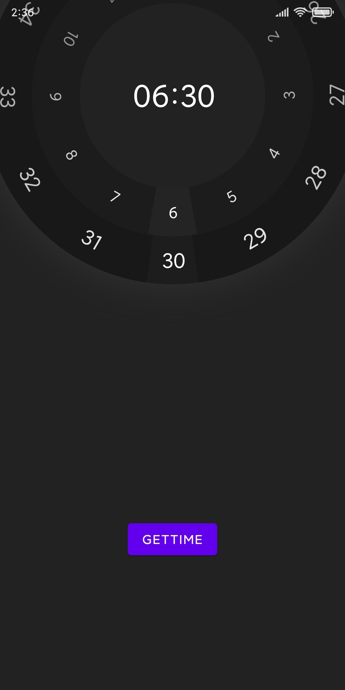
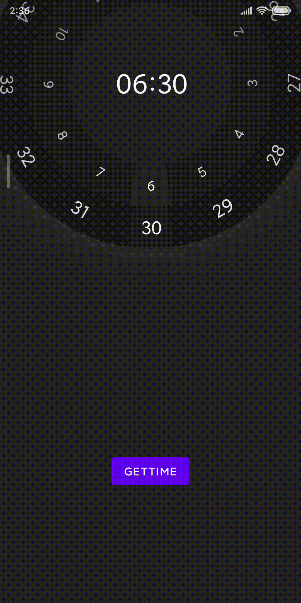

# ClockDialView
 
一个时钟表盘 view,灵感及配色来自于 https://dribbble.com/shots/5841472-Turntable-type-alarm-clock

与其不同的是,我去掉了设置 AM 或 PM 的按钮,改为了使用 24 小时制,分钟的设置粒度从 5 分钟改为了 1 分钟,底部的投影没能还原出来,改为了阴影

## 截图




## 如果你想使用的话
复制该文件`ClockDialView\app\src\main\java\com\application\clockdialview\ClockDialView.java`
以及 `ClockDialView\app\src\main\res\values\attrs.xml`
两个文件内容到你的项目中,在 xml 文件中添加类似下面的代码即可
```xml
    <com.application.clockdialview.ClockDialView
        android:id="@+id/clock_dial_view"
        android:layout_width="match_parent"
        android:layout_height="match_parent"
        app:backgroundColor="#222222"/>
```
使用 `getTime()` 或 `setTime()` 来获取或设置当前显示的时间

可以使用下面的参数进行自定义

| 参数                  | 作用                                                              |
| --------------------- | ----------------------------------------------------------------- |
| backgroundColor       | view 的背景颜色                                                   |
| inner_BackgroundColor | 内圈的背景颜色                                                    |
| outer_BackgroundColor | 外圈的背景颜色                                                    |
| shadowColor           | 外圈外部阴影颜色                                                  |
| inner_SelectedColor   | 内圈选中时间的颜色                                                |
| outer_SelectedColor   | 外圈选中时间的颜色                                                |
| inner_HourTextColor   | 内圈文字的颜色                                                    |
| outer_MinuteTextColor | 外圈文字的颜色                                                    |
| center_TextColor      | 中心文字的颜色                                                    |
| radius                | 圆环半径                                                          |
| innerArcWidth         | 内圈圆环的宽度                                                    |
| outerArcWidth         | 外圈圆环的宽度                                                    |
| inner_HourTextSize    | 内圈文字大小                                                      |
| outer_MinuteTextSize  | 外圈文字大小                                                      |
| center_TextSize       | 中心文字大小                                                      |
| offsetX               | view 相对于中心的水平偏移                                         |
| offsetY               | view 相对于中心的垂直偏移,注意,垂直偏移需要遮住 view 的上面一部分 |